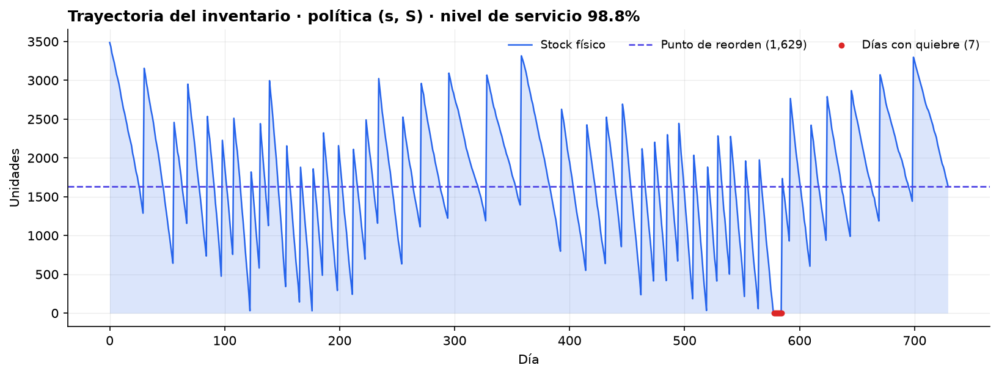
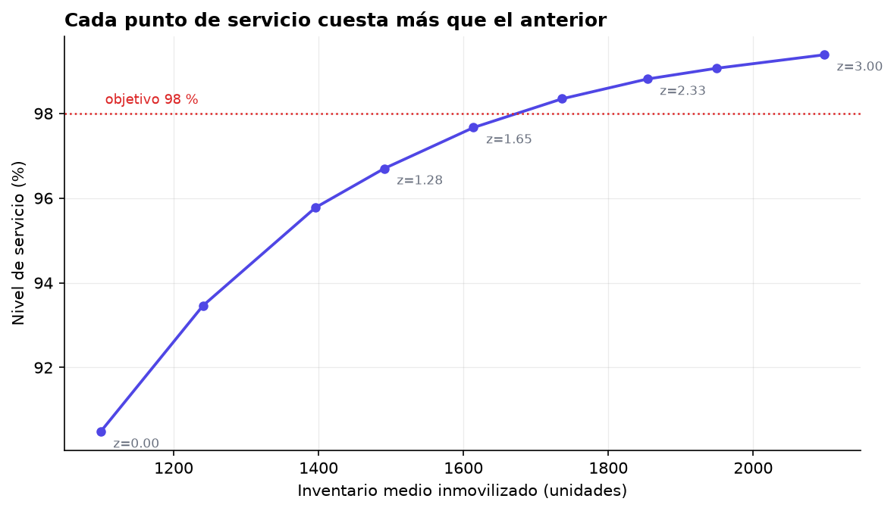

# Punto de reorden y sugerido de compra

Cuánto inventario cuesta cada punto de nivel de servicio, cuando ni la demanda
ni el proveedor son puntuales.



## El problema

En una comercializadora de insumos agrícolas, quebrar stock en plena temporada
de siembra cuesta la venta —y probablemente al cliente, que compra al lado ese
mismo día—. Sobre-stockear inmoviliza capital en un negocio de márgenes
estrechos.

La pregunta operativa no es "¿cuánto pedimos?". Es **"¿en qué nivel disparamos
el pedido, y de qué tamaño?"**, y no tiene una respuesta única: tiene una
frontera de decisiones, cada una con un costo.

## El enfoque

Política **(s, S)** simulada día a día durante dos temporadas completas:

- **Demanda** con estacionalidad anual y **sobredispersión**. Los pedidos llegan
  en lotes grandes y esporádicos, así que la varianza supera a la media; una
  Poisson la subestimaría. Se usa binomial negativa.
- **Plazo de entrega** lognormal discretizado: casi siempre ~7 días, con cola a
  la derecha. Esa cola es la que provoca los quiebres.
- **Punto de reorden** con incertidumbre en ambas fuentes:

  ```
  ROP = μ_D · μ_L  +  z · √( μ_L · σ_D²  +  μ_D² · σ_L² )
  ```

  El segundo término bajo la raíz es el que se olvida con frecuencia. **Si el
  proveedor es errático, la variabilidad del plazo domina el stock de seguridad**,
  y comprar más seguido no arregla nada.
- **Tamaño del pedido** por cantidad económica (Wilson), sobre el punto de reorden.
- Reposición decidida sobre la **posición de inventario** (stock físico + lo ya
  pedido y no recibido), no sobre el stock físico. Es lo que evita pedir dos
  veces lo mismo mientras un pedido viaja.

### Rigor de la simulación

Dos decisiones que cambian si los resultados significan algo:

1. **Números aleatorios comunes.** Todas las políticas se enfrentan
   *exactamente* al mismo escenario de demanda y de retrasos. Sin esto la curva
   de servicio sale no monótona y las comparaciones son ruido. En una primera
   versión de este código el nivel de servicio bajaba al subir el stock de
   seguridad — un artefacto puro del muestreo.
2. **40 réplicas por política**, con error estándar reportado. Los intervalos
   quedan en ±0.002, suficiente para distinguir las políticas entre sí.

Los parámetros se **estiman de un histórico simulado**, no se leen del proceso
verdadero. Es como funciona en la práctica.

## El resultado

| z | Servicio teórico (ciclo) | Punto de reorden | Servicio real (fill rate) | Inventario medio |
|---|---|---|---|---|
| 0.00 | 50.0 % | 903 | 90.5 % | 1 099 |
| 1.00 | 84.1 % | 1 266 | 95.8 % | 1 396 |
| 1.65 | 95.1 % | 1 502 | 97.7 % | 1 614 |
| **2.00** | **97.7 %** | **1 629** | **98.3 %** | **1 736** |
| 3.00 | 99.9 % | 1 991 | 99.4 % | 2 098 |



**Los rendimientos decrecen rápido.** Pasar de 90 % a 96 % de servicio cuesta
unas 300 unidades de inventario medio. Pasar de 98 % a 99.4 % cuesta 360 más,
para menos de un cuarto de la mejora. Esa curva es la conversación que hay que
tener con el negocio, y es la razón por la que "queremos 99.9 %" casi nunca
sobrevive al costo.

**El servicio real supera al teórico**, y no es un error. Son dos métricas
distintas que se confunden a menudo:

- El **nivel de servicio de ciclo** que fija `z` es la probabilidad de *no
  quebrar durante un ciclo de reposición*.
- El **fill rate** es la *fracción de demanda efectivamente servida*.

Un quiebre de dos días al final de un ciclo cuenta como ciclo fallido completo,
pero apenas mueve el fill rate. Fijar `z` creyendo que se está fijando el fill
rate lleva a sobre-stockear sistemáticamente.

## Ejecutar

```bash
pip install -r requirements.txt
python reorden.py
```

Reproducible: semilla fija (`SEMILLA = 20260802`). Genera las figuras en
`static/poc/punto-reorden/` y la tabla completa en `resultados.csv`.

## Datos

**Sintéticos.** Generados por el propio script. No proceden de ninguna empresa
ni contienen información de clientes, proveedores o precios reales.
