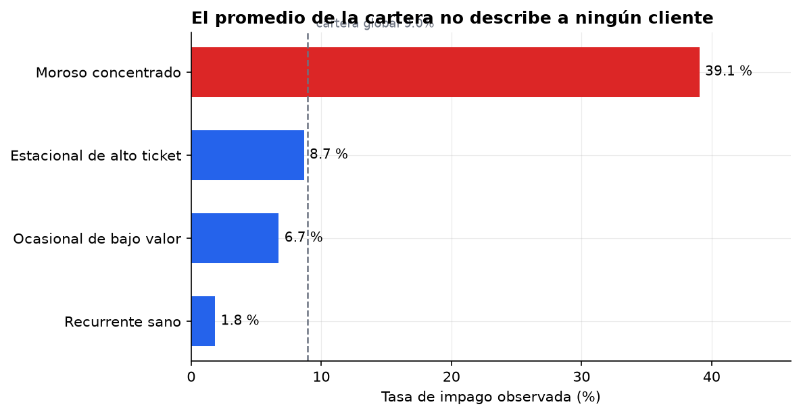
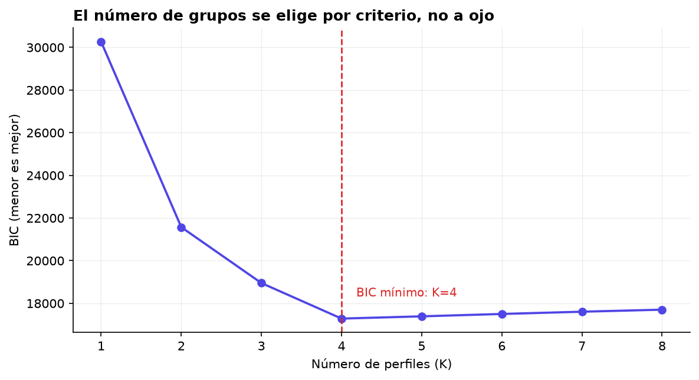
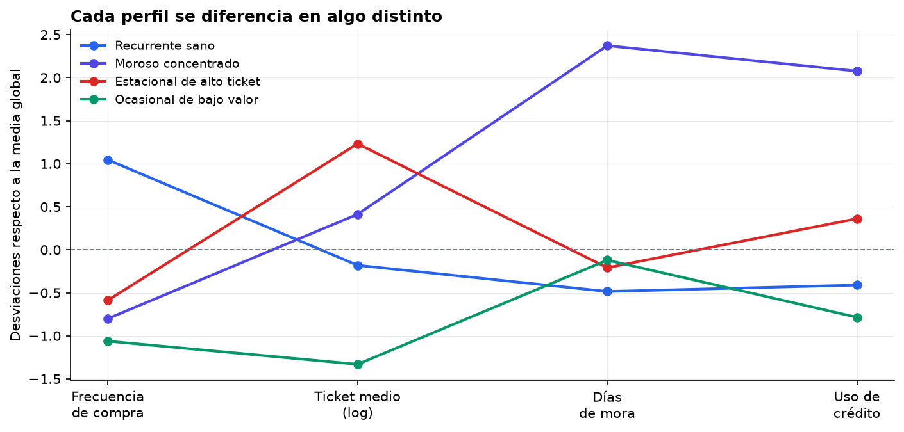

# Perfiles latentes, clusters y riesgo

Cuántas poblaciones hay escondidas dentro de una cartera, y por qué el promedio
no describe a ninguna.



## El problema

Una cartera de clientes no es una población: son varias mezcladas. Tratarlas con
un promedio único esconde justo lo que interesa —quién paga tarde, quién compra
estacionalmente, quién concentra el riesgo—.

La pregunta no es "¿cuál es el cliente medio?". Es **"¿cuántas poblaciones hay
aquí dentro, y en qué se diferencian?"**.

## El enfoque

Análisis de **perfiles latentes** sobre cuatro indicadores continuos: frecuencia
de compra, ticket medio, días de mora y uso de la línea de crédito.

- **Modelo de mezcla gaussiana** con covarianza libre por componente. Cada perfil
  puede tener su propia dispersión y su propia estructura de correlación — que
  es como se comportan los segmentos reales.
- **El número de grupos se elige por BIC**, no mirando el gráfico. Sin una
  penalización por complejidad, añadir grupos siempre mejora el ajuste y se
  termina segmentando ruido.
- **Comparación contra k-means**, evaluando ambos con el índice de Rand ajustado
  frente a la estructura verdadera —que aquí se conoce, porque los datos son
  simulados—.

### Un detalle que arruina segmentaciones

El índice que el modelo asigna a cada grupo **es arbitrario**. No tiene por qué
coincidir con el orden de las clases reales. Hay que mapear cada grupo
recuperado a la clase mayoritaria dentro de él antes de ponerle nombre.

Una primera versión de este código no lo hacía, y el gráfico de perfiles salió
con el grupo moroso rotulado como "estacional de alto ticket". Los números
estaban bien; la lectura era falsa. En una segmentación real, sin datos
simulados contra los que contrastar, ese error no se detecta.

## El resultado

**El BIC recupera exactamente los 4 perfiles simulados.**



| Método | Índice de Rand ajustado |
|---|---|
| Mezcla gaussiana | **0.979** |
| k-means | 0.926 |

La mezcla gana, aunque no por goleada. La diferencia viene de los perfiles con
dispersión alta: k-means asume grupos esféricos y de tamaño parecido, así que
tiende a partir el grupo disperso y a absorber su cola en los vecinos. Con
segmentos más solapados la brecha se abre; conviene no vender k-means como
inservible, sino saber cuándo su supuesto no se cumple.



**Lo que importa para el negocio:**

| Perfil | Clientes | Impago |
|---|---|---|
| Recurrente sano | 1 303 | 1.8 % |
| Ocasional de bajo valor | 609 | 6.7 % |
| Estacional de alto ticket | 727 | 8.7 % |
| **Moroso concentrado** | **361** | **39.1 %** |

La cartera global impaga **9.0 %**. Ese número no describe a nadie: el riesgo
varía **21 veces** entre el mejor y el peor perfil, y el 12 % de los clientes
concentra la mayor parte de las pérdidas. Una política de crédito construida
sobre el promedio es cara para los buenos clientes y barata para los malos —
exactamente al revés de lo que se busca.

## Ejecutar

```bash
pip install -r requirements.txt
python perfiles.py
```

Reproducible: semilla fija (`SEMILLA = 20260802`). Genera las figuras en
`static/poc/perfiles-latentes/` y las tablas en `seleccion.csv` y
`riesgo-por-perfil.csv`.

## Datos

**Sintéticos.** Generados por el propio script como mezcla finita de cuatro
perfiles con parámetros declarados en el código. No proceden de ninguna empresa
ni contienen información de clientes reales.
