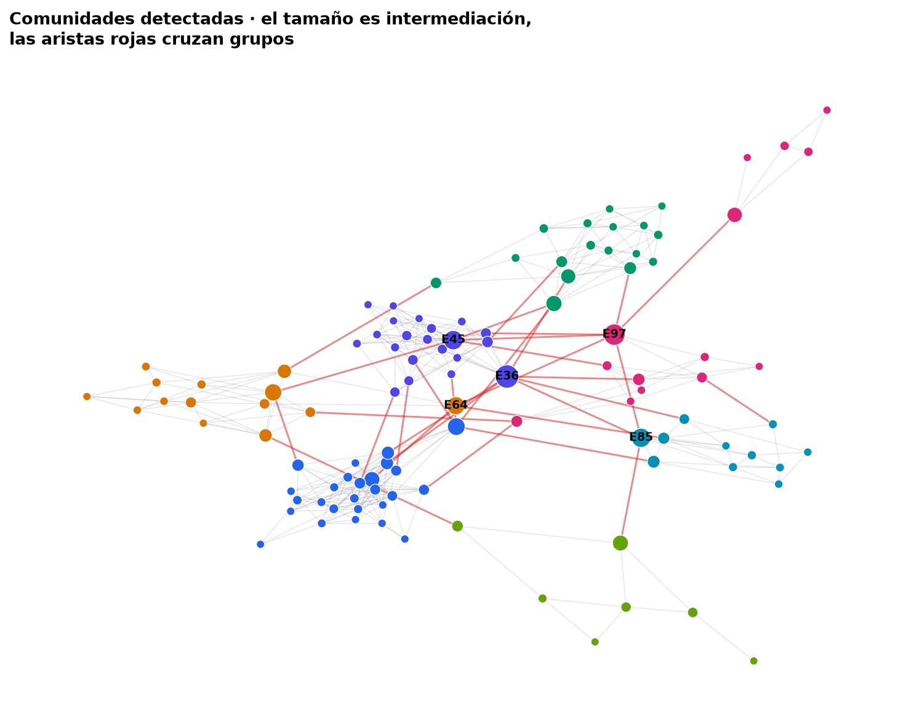
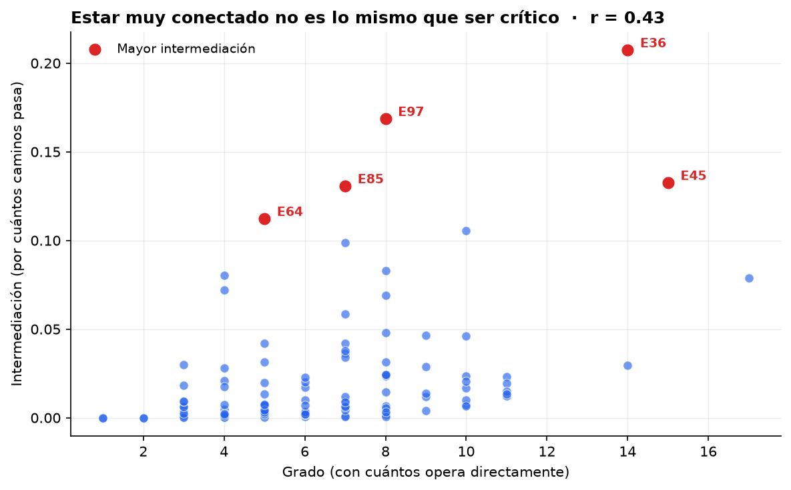

# Grafos y redes de relaciones

Qué revela la estructura que no revela la tabla.



## El problema

En una cartera de proveedores y clientes, las entidades no son independientes.
Comparten domicilios, representantes, cuentas bancarias. Una tabla las muestra
como filas separadas; el grafo muestra que quince de ellas son en realidad un
mismo grupo económico.

Esa diferencia importa para el **riesgo de concentración** —creer que se tienen
quince proveedores cuando se tiene uno— y para detectar **partes relacionadas**
que no se declararon.

## El enfoque

Red de 110 entidades y 356 relaciones, con ocho grupos económicos de tamaño
desigual, enlaces cruzados legítimos entre ellos, y un puñado de **entidades
puente** que operan con varios grupos a la vez.

- **Detección de comunidades por modularidad** (Louvain). A diferencia de un
  clustering clásico, no hay que decirle cuántos grupos buscar: la modularidad
  los determina. Es una ventaja real cuando no se sabe cuántos grupos hay, que
  es siempre.
- **Tres medidas de centralidad** que responden preguntas distintas:

  | Medida | Pregunta que responde |
  |---|---|
  | Grado | ¿Con cuántos opera directamente? |
  | Intermediación | ¿Por cuántos caminos más cortos pasa? |
  | Vector propio | ¿Está conectado a entidades importantes? |

## El resultado

| Métrica | Valor |
|---|---|
| Grupos económicos reales | 8 |
| Comunidades detectadas | 7 |
| Modularidad | 0.711 |
| Índice de Rand ajustado | **0.971** |

La detección recupera casi perfectamente la estructura, fusionando dos de los
grupos más pequeños y enlazados entre sí — que es el comportamiento esperable, y
honesto de reportar.

### Lo importante: grado ≠ criticidad



La correlación entre grado e intermediación es **0.43**. Si midieran lo mismo,
los puntos caerían sobre una recta. No caen.

| Entidad | Grado | Intermediación |
|---|---|---|
| E36 | 14 | 0.207 |
| E97 | 8 | 0.169 |
| E45 | 15 | 0.133 |
| E85 | 7 | 0.131 |
| **E64** | **5** | **0.112** |

**E64 tiene grado 5** —está entre las entidades menos conectadas— y sin embargo
es la quinta más crítica de toda la red. Es el único puente entre dos grupos: si
desaparece, la red se parte.

Un análisis que ordene por número de relaciones nunca la habría visto. Y en
riesgo operacional, de concentración o de fraude, **el puente suele importar
más que el nodo grande**.

## Ejecutar

```bash
pip install -r requirements.txt
python grafos.py
```

Reproducible: semilla fija (`SEMILLA = 20260802`). Genera las figuras en
`static/poc/grafos-relaciones/` y la tabla en `centralidad-top.csv`.

## Datos

**Sintéticos.** Generados por el propio script. No proceden de ninguna empresa
ni describen relaciones reales entre entidades.
