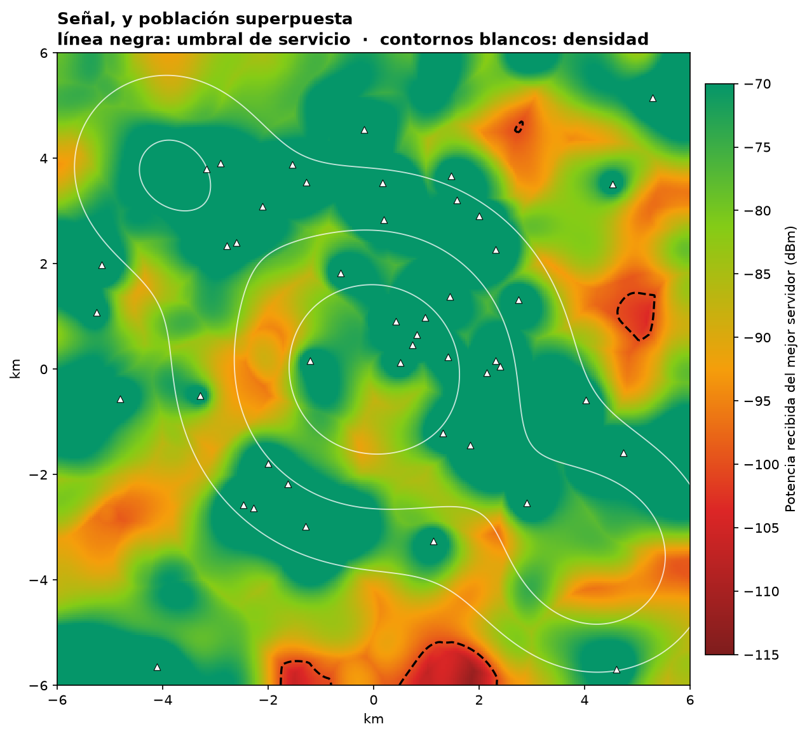
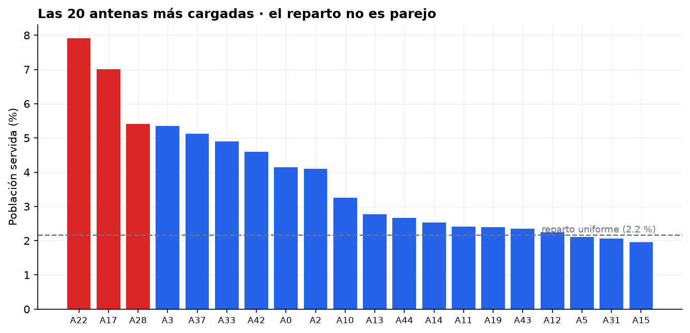
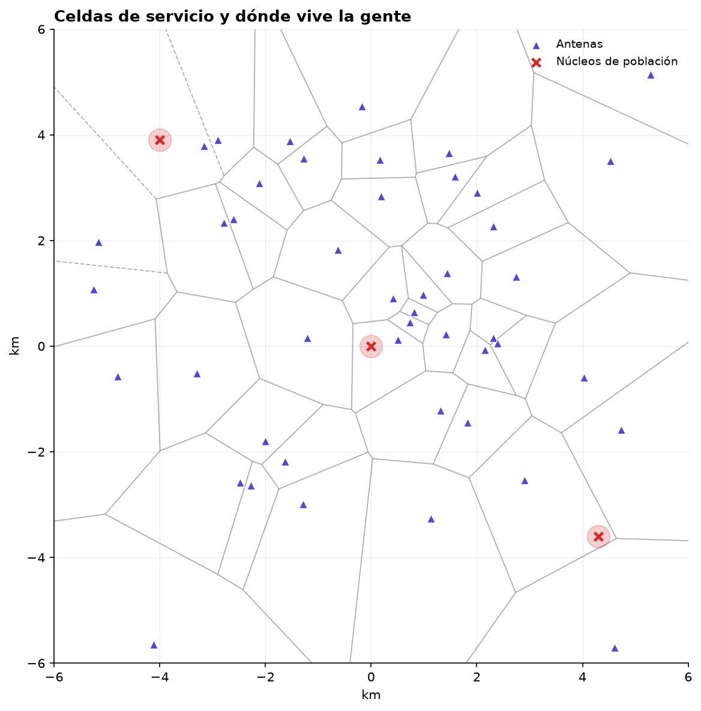

# Geolocalización y cobertura de red celular

Dónde falta señal, y a cuánta gente le afecta de verdad.



## El problema

Una red de antenas no se evalúa por cuántas antenas tiene, sino por a cuánta
gente deja sin servicio. Un hueco sobre un cerro deshabitado no importa; el
mismo hueco sobre un barrio denso es una avería comercial.

La pregunta no es "¿qué porcentaje del territorio cubrimos?" sino **"¿qué
porcentaje de la población, y dónde está la que no?"**.

## El enfoque

Ciudad sintética de 12 × 12 km con 46 antenas y tres núcleos de población.

- **Teselación de Voronoi** para la geometría de servicio.
- **Propagación log-distancia**: `P_rx = P_tx − 10·n·log₁₀(d)`, con n = 3.4.
- **Sombreado log-normal correlacionado espacialmente**, σ = 9 dB.
- **Pérdida de penetración a interiores**, 19 dB de media.
- Cobertura evaluada **ponderada por población**, no por área.

### Dos correcciones al modelo que cambiaron el resultado

Este PoC pasó por dos versiones que daban **cero huecos de cobertura**, y las
dos eran errores de modelado que vale la pena contar:

**1. Pérdida por distancia sola no produce huecos.** Con 46 antenas en 12 km,
hasta el punto más alejado recibe unos −85 dBm, muy por encima de cualquier
umbral. La conclusión habría sido "no hay problemas de cobertura", y es falsa.
Los huecos reales no los causa la distancia: los causa la **obstrucción**.

**2. Sombra independiente por antena tampoco.** Al añadir sombreado por enlace
seguían sin aparecer huecos: el móvil se queda con el **máximo** de 46 enlaces,
y con desvanecimientos independientes la diversidad macro los promedia — siempre
hay alguna antena que llega bien.

En la realidad los enlaces no son independientes: el edificio que bloquea al
móvil lo bloquea en casi todas las direcciones. Se modela con una componente
común más una por enlace,

```
S_i = √ρ · S_común  +  √(1−ρ) · S_i        con ρ ≈ 0.5
```

La componente común no se promedia, y es la que abre los huecos.

## El resultado

| Métrica | Valor |
|---|---|
| Territorio sin servicio | 1.34 % |
| **Población sin servicio** | **0.33 %** |
| Razón población / territorio | 0.25× |

**Los huecos caen sobre terreno poco poblado: la métrica de territorio exagera
el problema cuatro veces.** Si el comité decide inversión mirando el porcentaje
de superficie, va a comprar antenas para cubrir campo vacío.

> **Nota honesta.** El escenario se diseñó esperando lo contrario —antenas
> ancladas al centro histórico mientras la población migró a la periferia, de
> modo que los huecos golpearan a la gente—. No salió así: las pocas antenas
> periféricas bastan para cubrir los polos de población.
>
> Se deja el resultado tal cual. Ajustar los parámetros hasta que la simulación
> diga lo que uno quería es exactamente el error que este PoC ilustra. La
> lección metodológica se sostiene igual, y en la dirección contraria: la
> métrica de territorio y la de población **no coinciden**, y hay que mirar la
> segunda — dé buenas o malas noticias.

### El hallazgo accionable está en otro lado



**Cinco de las 46 antenas sirven al 30.8 % de la población.** Un reparto
uniforme daría 10.9 %. Ese desequilibrio —tres veces la carga esperada— es
donde la red se congestiona en hora punta, y es un problema real aunque la
cobertura sea excelente.



## Sobre las vistas satelitales

Deliberadamente **no** se usa un mapa base satelital. Requeriría teselas de un
proveedor externo, lo que en este sitio choca con dos cosas: la
`Content-Security-Policy` es `default-src 'self'`, y las teselas tienen
condiciones de licencia y atribución propias.

Para un despliegue real se resolvería con un proveedor licenciado y una CSP
ampliada a ese origen concreto. Aquí la geometría y el análisis son el punto;
el fondo bonito no cambia ninguna conclusión.

## Ejecutar

```bash
pip install -r requirements.txt
python cobertura.py
```

Reproducible: semilla fija (`SEMILLA = 20260802`). Genera las figuras en
`static/poc/geolocalizacion-celular/` y la tabla en `carga-por-antena.csv`.

## Datos

**Sintéticos.** Generados por el propio script. No proceden de ningún operador
ni describen el despliegue real de ninguna red.
